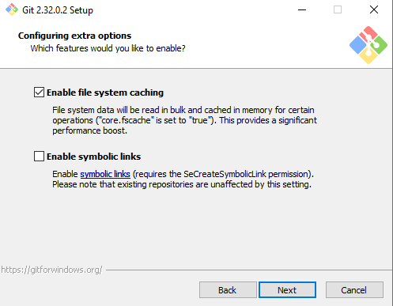

# Tutorial de instalação do Git em Sistema Operacional Windows

## Etapa 1:

Baixe o instalador do programa disponível no site oficial. Basta clicar em "Click here to download manually" e o download irá ser iniciado. Abra o arquivo em seguida.

Link do site oficial para download: https://git-scm.com/download/win

## Etapa 2:

Clique em "Next" para dar continuidade ao processo de instalação.

## Etapa 3:

Selecione a pasta onde o arquivo será instalado. É recomendado utilizar a pasta sugerida pelo próprio instalador, ou seja, basta clicar em "Next" e seguir para o próximo passo.

## Etapa 4:

Selecione os componentes que serão instalados. É recomendado instalar os componentes pré-selecionados pelo instalador, da mesma maneira da imagem à seguir. Caso queira criar um atalho em sua Área de Trabalho, selecione também os ítens "Additional icons" e "On the Desktop".
Clique em "Next" para prosseguir.

## Etapa 5:

Selecione a pasta onde devem ficar os atalhos do programa. É recomendado utilizar a pasta padrão selecionada pelo próprio instalador.
Clique em "Next" para prosseguir.

## Etapa 6:

Escolha o editor padrão para ser utilizado pelo Git. É recomendado utilizar o editor Vim, para isso, selecione a opção "Use Vim (the ubiquitous text editor) as Git's default editor".
Clique em "Next" para prosseguir.

## Etapa 7:

Caso queira utilizar o nome padrão do Branch Inicial, ou seja, o nome "master", selecione a oção "Let Git decide". Caso queira escolher um nome, selecione a opção "Override the default branch name for new repositories" e digite abaixo o nome escolhido.
Após escolher a alternativa, clique em "Next" para prosseguir.

## Etapa 8:

Selecione o caminho de seu ambiente. Para usuários comuns, a opção recomendada é "Git from the command line and also from 3rd-party softwarwe". Caso essa opção não seja selecionada, alguns recursos de terceiros não poderão ser utilizados.

## Etapa 9:

Selecione qual biblioteca de SSL/TLS que você quer que o Git utilize para conexões HTTPS. É recomendado selecionar a opção "Use the OpenSSL library".

## Etapa 10:

Para o sistema operacional Windows, selecione a opção "Checkout Windows-style, commit Unix-style line endings".
Clique em "Next" para prosseguir.

## Etapa 11:

Selecione se o Git irá poder utilizar somente os terminais nativos do Windows ou se ele poderá utilizar outros tipos de terminais. É recomendado deixar o Git utilizar qualquer tipo de  terminal, para isso, selecione a opção "Use MinTTY (the defalt terminal of MSYS2)".
Clique em "Next" para prosseguir.

## Etapa 12:

Selecione o comportamento padrão do git pull. É recomendado selecionar a opção "Default" utilizando o Merge. Para evitar poluições de gerenciamento de conflitos, pode também se utilizar a opção "Rebase", no entanto, a falta de documentação no gerenciamento de conflitos pode gerar dificuldades na correção de bugs introduzidos no processo anterior.
Clique em "Next" para prosseguir.

## Etapa 13:

Escolha entre as ferramentas de credencial. É recomendado selecionar a opção "Git Credential Manager Core", pois é a opção mantida pelo Git atualmente.
Clique em "Next" para prosseguir.

## Etapa 14:

Selecione os recursos extras que você gostaria de instalar. É recomendavel manter selecionada ao menos a opção "Enable file system catching" por motivos de performance.
Clique em "Next" para prosseguir.

## Etapa 15:

Nesta etapa não é necessário selecionar nada, pois apenas estão sendo oferecidos recursos experimentais (ainda em desenvolvimento).
Clique em "install" e aguarde o processo de instalação.

## Etapa 16:

Clique em "Finish" e finalize o processo de instalação do Git. Caso queira que o programa seja inicializado logo após finalizar este processo, selecione a opção "Launch Git Bash".

