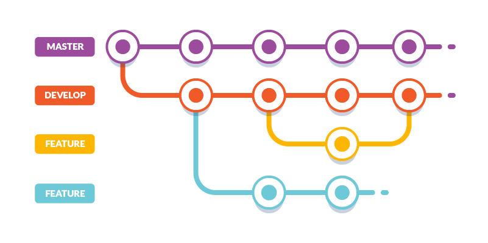

# Reunião - Treinamento

**04 JULHO 2021** / 14:30 PM / JITSI MEET

## Participantes

Ronaldo Murilo, Fernanda Becker, Cristina Rangel, Juca Ferreira

## Agenda

**Follow-up**
1.	Ementa do curso de Django  

**To-Do**

2.	Discutir nome para criação de conteúdo  
3.	Definição de carga horária 

## Notas

*	**Fernando pode ser uma escolha para criar o curso.** Atualmente trabalha e suporta um produto em Django.
*	Previsão de carga horária para 60h. 
*	**Incluir o seguinte fluxo de versionamento no curso:**

## Ações

1.	Enviar e-mail para Fernando com proposta de criação de curso 
2.	Encaminhar ementa para equipe para discussão
	
## Próxima reunião

Verificar andamento dos cursos:

| Curso    | Autor | Status |
| :-----------: | :-----------: | :-----------: |
| Introdução a Versionamento de Código     | Pattricia Medeiros      | Em Andamento |
| Welcome to the Django   | Fernando        | Não Iniciado |
| Linguagem SQL para Banco de Dados | Julio Fernandes | Em Revisão |
| Linux Beginners in Cloud | Juca Ferreira | Concluido |
