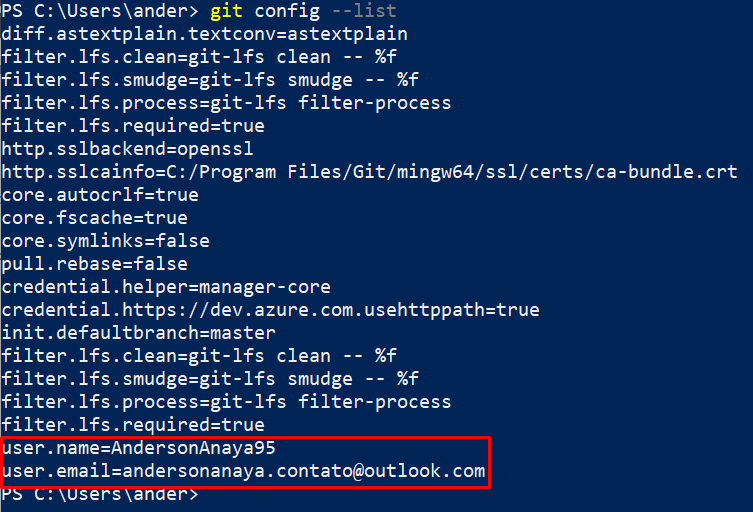
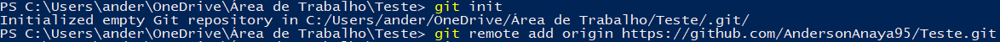
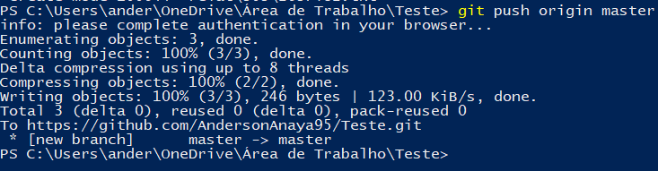
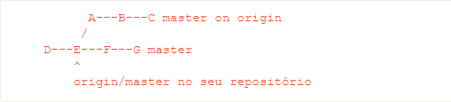
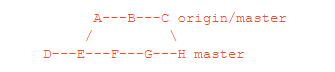
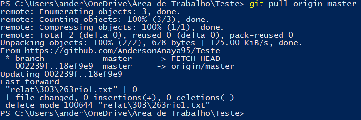
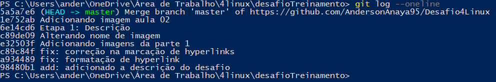

# Tutorial de Comandos Básicos do Git

## Identidade:

* git config --global user.name

  Este comando altera globalmente o nome de usuário associado a realização dos commits.

  `git config --global user.name "AndersonAnaya95"`

* git config --global user.email

  Este comando altera globalmente o email associado ao usuário.

  `git config --global user.email andersonanaya.contato@outlook.com`

Para verificar se seus comandos funcionaram, é possível utilizar o `git config --list`. O resultado deve ficar da seguinte maneira:

## Inicialização:

Todos os comando abaixo devem ser feitos dentro do diretório do projeto.

* git init

    Este comando inicia o Git no repositório.
    
    `git init`

  * git remote

    Este comando vincula o link do repositório do Github ao nome **origin**.

    `git remote add origin https://github.com/AndersonAnaya95/Teste.git`
    
    
    
    Na imagem acima, primeiramente foi iniciado o git no repositório através do `git init` e após a inicialização foi iniciado o diretório local com o remoto.
    
  * git clone
  
    Transfere os arquivos do repositório online para a sua máquina.
    
    `git clone https://github.com/AndersonAnaya95/Desafio4Linux.git`
    
    
## Modificação:

* git add

  Este comando seguido do identificador do arquivo adiciona o mesmo a fila para a realização do commit.

    * git rm
  
      Este comando seguido do identificador do arquivo remove o mesmo do diretório.
  
    * git commit
  
      Este comando registra uma atividade realizada.
  
    * git push
  
      Este comando faz o upload das alterações para o diretório remoto.
  
      `git push origin master`
  
      O comando acima envia os arquivos para o repositório remoto, com o apelido de **origin** no branch principal.
      
      
      
      Na imagem acima, após a execução do comando é apresentado um relatório exibindo o status da operação. No caso dessa imagem, ele exibe que o push foi realizado com sucesso e mostra a quantidade de alterações.
  
    * git pull
  
      Este comando solicita a atualização do diretório local puxando as informações do diretório remoto.
      
      Antes da realização do git pull:
      
      
      
      Depois da utilização do git pull:
      
      
  
      `git pull origin master`
  
      O comando acima baixa qualquer alteração realizada no repositório remoto, com o apelido de **origin** no branch principal.
      
      
      
      Na imagem acima é apresentado o status do repositório remoto em comparação com o repositório local (quantidade de arquivos diferentes entre os locais) e notifica a atualização do local.

## Inspeção:

* git status

  Este comando retorna o estado do diretório (exibe se existem arquivos alterados).

    * git log
  
      Exibe os commits realizados.
      
      
      
      A imagem acima exibe os últimos commits realizados de forma abreviada.
      Obs: o parâmetro `--oneline`é opcional e fou utilizado para reduzir o tamanho da imagem neste tutorial.
      
